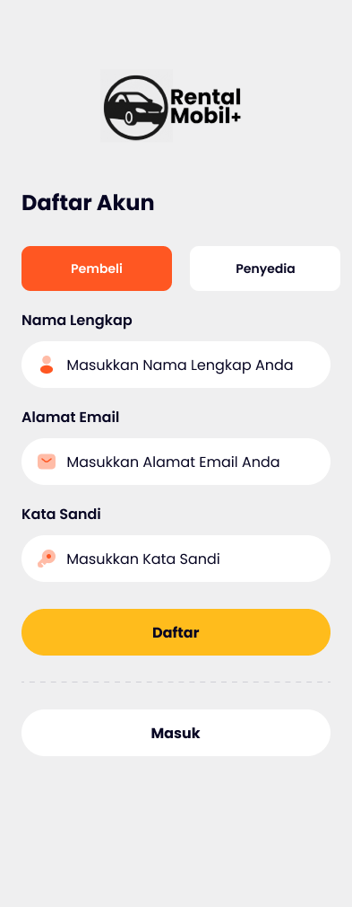

# Aplikasi Sewa Mobil (RentCar+ App)

Aplikasi sewa mobil berbasis Flutter yang memungkinkan pengguna untuk mencari, melihat detail, dan menyewa mobil dengan mudah.  
Terdapat 3 Antarmuka Pengguna (User Interface/UI) yang berbeda, yaitu: **Pembeli**, **Penyedia**, dan **Admin** dengan masing-masing fitur yang telah disesuaikan.

---

## 📱 Desain Aplikasi (UI/UX)

Lihat pratinjau desain interaktif kami langsung dari Figma.
[👉 Link Figma](https://www.figma.com/design/72flWeSJv6ZKEyxYKSNmbZ/RentCar--App?node-id=0-1&p=f&t=OZkWQbtmndWUNdzD-0)

### 📸 Preview UI

    
    
    
    

    
    
    
    

    
    
    
    

    
    
    
    

    
    
    
    

---

## 🚀 Fitur Utama

- **Splash Screen**: Halaman awal saat aplikasi dibuka.
- **Onboarding**: Panduan singkat bagi pengguna baru.
- **Login & Register**: Sistem autentikasi pengguna untuk Masuk atau Daftar Akun sebagai Pembeli atau Penyedia.
- **Halaman Discover**: Menampilkan daftar Produk Populer dan Terbaru.
- **Halaman Detail Produk**: Informasi lengkap tentang spesifikasi, deskripsi, atau harga sewa suatu Produk.
- **Halaman Notifikasi UI**: Menerima notifikasi pada aplikasi untuk menerima chat/pesan masuk, status booking, dan orderan masuk
- **Sistem Chat**: Fitur chat real-time antara Penyedia Sewa dengan Pembeli atau sebaliknya.
- **Halaman Pengaturan**: Edit informasi Profil pengguna.
- **Night Mode**: Mengatur Tema Aplikasi menjadi mode malam atau sebaliknya

### 👤 Fitur Pembeli

- **Halaman Booking**: Memilih tanggal sewa dan opsi tambahan seperti driver.
- **Halaman Checkout**: Ringkasan pesanan, biaya, dan pilihan metode pembayaran.
- **Halaman Buat PIN**: Membuat PIN pertama kali untuk pembayaran dengan metode Dompet Digital.
- **Halaman PIN**: Verifikasi keamanan dengan PIN untuk melanjutkan pembayaran.
- **Halaman Order**: Melihat riwayat dan status pesanan.
- **Halaman Favorite**: Mengelola produk yang disimpan sebagai favorit pembeli.
- **Halaman Pengaturan**: Top Up Saldo, Buat atau Ganti PIN.

### 👨‍💼 Fitur Penyedia

- **CRUD Produk**: Menambahkan, Mengedit, dan Menghapus Produk
- **Halaman Order**: Mengelola riwayat dan status pesanan.
- **Halaman Notifikasi UI**: Menerima notifikasi pada aplikasi untuk menerima chat/pesan masuk, status booking, dan orderan masuk
- **Halaman Pengaturan**: Menerima Saldo dari produk yang di Order oleh Pembeli

### 🛠️ Fitur Admin

- **CRUD Produk**: Menambahkan, Mengedit, dan Menghapus Produk
- **Halaman Booking**: Memilih tanggal sewa dan opsi tambahan seperti driver.
- **Halaman Checkout**: Ringkasan pesanan, biaya, dan pilihan metode pembayaran.
- **Halaman Buat PIN**: Membuat PIN pertama kali untuk pembayaran dengan metode Dompet Digital.
- **Halaman PIN**: Verifikasi keamanan dengan PIN untuk melanjutkan pembayaran.
- **Halaman Order**: Mengelola atau melihat riwayat dan status pesanan.
- **Halaman Favorite**: Mengelola produk yang disimpan sebagai favorit pembeli.
- **Halaman Pengaturan**: Top Up Saldo, Buat atau Ganti PIN, Cek Saldo untuk menerima Saldo dari produk yang di Order oleh Pembeli

## 🛠️ Teknologi yang Digunakan

Proyek ini dikembangkan menggunakan teknologi dan arsitektur berikut:

- **Framework**: Flutter
- **Bahasa Pemrograman**: Dart
- **Manajemen State**: GetX
- **Arsitektur**: MVVM
- **Database**: Firebase Firestore
- **Autentikasi**: Firebase Authentication
- **Media Hosting**: Cloudinary
